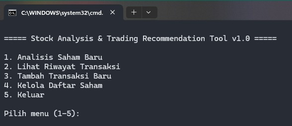
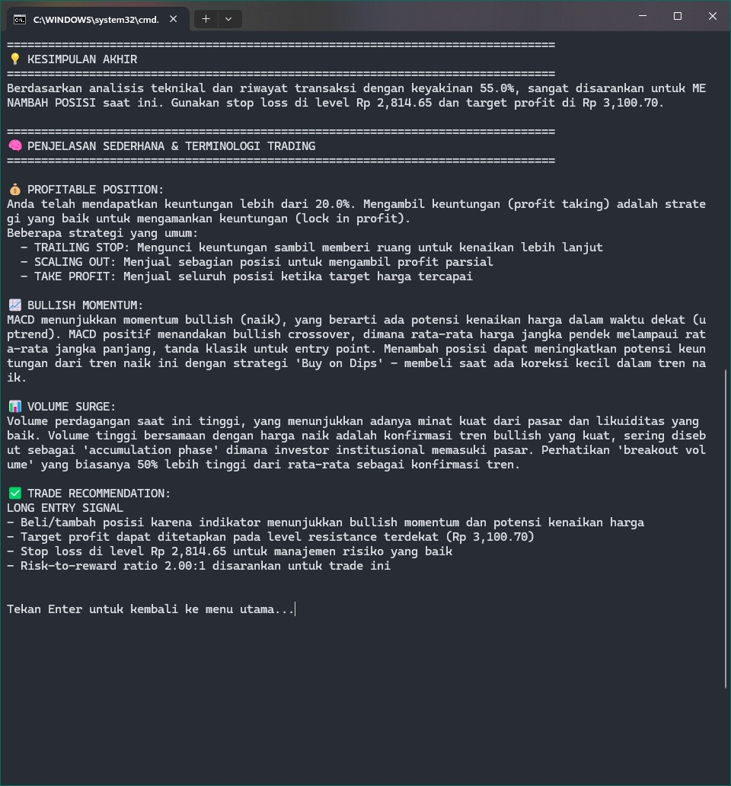
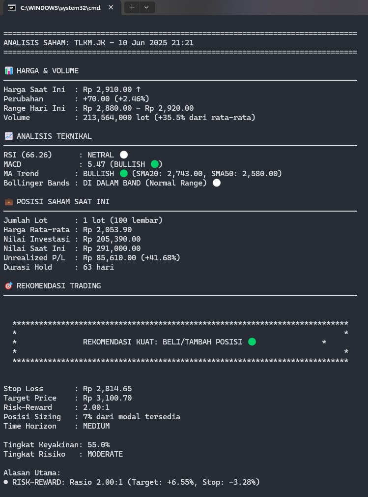

# Stock Analysis & Trading Recommendation Tool v1.1.0



## Deskripsi
Stock Analysis & Trading Recommendation Tool adalah aplikasi command-line berbasis Python yang membantu investor dan trader untuk menganalisis saham, mencatat transaksi trading, dan mendapatkan rekomendasi berdasarkan analisis teknikal dan fundamental.

[](https://github.com/nandurstudio/stock-analysis/actions/workflows/python-tests.yml)
[](https://opensource.org/licenses/MIT)
[](https://www.python.org/downloads/)

## Fitur Utama
1. **Antarmuka GUI Modern (Baru di v1.1.0)**
   - Analisis saham, pencatatan transaksi, dan visualisasi chart langsung dari GUI
   - Tab Analisis Saham, Riwayat Transaksi, Tambah Transaksi, Kelola Saham, dan Tentang
   - Output analisis lengkap dan chart candlestick interaktif dengan penanda posisi user
   - Tab Tentang dinamis (info dari `developer_info.txt`)
   - Jalankan GUI dengan mudah via `run_gui_app.bat`

2. **Analisis Teknikal Komprehensif**
   - Menghitung indikator teknikal seperti RSI, MACD, Bollinger Bands, SMA, EMA
   - Memvisualisasikan data saham dan indikator teknikal
   - Mengidentifikasi tren dan sinyal trading

3. **Pencatatan Transaksi**
   - Mencatat transaksi BUY/SELL dalam file CSV
   - Menghitung profit/loss untuk setiap transaksi
   - Menyimpan detail seperti harga, jumlah, tanggal, dan status transaksi

4. **Rekomendasi Trading Profesional**
   - Memberikan rekomendasi BUY/HOLD/SELL/SHORT SELL berdasarkan analisis teknikal
   - Menghitung tingkat keyakinan untuk rekomendasi
   - Menyertakan alasan dan penjelasan sederhana untuk rekomendasi
   - Menyesuaikan rekomendasi berdasarkan posisi saham saat ini

5. **Analisis Riwayat Transaksi**
   - Menganalisis pola trading berdasarkan transaksi sebelumnya
   - Menghitung win rate dan metrik performa trading
   - Menyesuaikan rekomendasi berdasarkan gaya trading dan preferensi pengguna

6. **Manajemen Risiko**
   - Merekomendasikan level stop loss dan target profit
   - Menghitung rasio risk-to-reward untuk setiap trade
   - Menyarankan posisi sizing berdasarkan profil risiko

## Instalasi

### Opsi 1: Untuk pengguna Windows (Direkomendasikan)
Jalankan file batch instalasi yang disediakan:
```
install.bat
```

Proses ini akan:
1. Memeriksa apakah Python sudah terinstal
2. Membuat virtual environment
3. Menginstal semua dependensi yang diperlukan
4. Menyiapkan paket untuk pengembangan

### Opsi 2: Instalasi Manual

1. Clone repository ini:
   ```bash
   git clone https://github.com/nandurstudio/stock-analysis.git
   cd stock-analysis
   ```

2. Buat virtual environment (direkomendasikan):
   ```bash
   python -m venv venv
   # Pada Windows:
   venv\Scripts\activate
   # Pada macOS/Linux:
   source venv/bin/activate
   ```

3. Instal paket dalam mode pengembangan:
   ```bash
   pip install -e .
   ```

## Menjalankan Aplikasi

### Opsi 1: Menggunakan file batch (Windows)
```bash
run_stock_analyzer.bat   # Untuk CLI
run_gui_app.bat          # Untuk GUI (Baru di v1.1.0)
```

### Opsi 2: Eksekusi langsung
```bash
# Menjalankan aplikasi utama
python main.py

# Menjalankan sebagai modul
python -m src
```

### Opsi 3: Command-line interface
```bash
# Menganalisis saham tertentu
python -m src --symbol BBCA.JK --period 1y

# Menganalisis dengan direktori output kustom
python -m src --symbol TLKM.JK --output my_analysis
```

### Cek Sistem
Untuk memverifikasi bahwa sistem Anda terkonfigurasi dengan benar:
```bash
python cek_sistem.py
```

### Menu Utama
Aplikasi memiliki 5 menu utama dengan navigasi intuitif:
1. **Analisis Saham Baru**
   - Menganalisis saham dan memberikan rekomendasi
   - Menampilkan visualisasi data teknikal
   - Memberikan rekomendasi trading dengan penjelasan detail
   - Kembali ke menu utama dengan menekan Enter tanpa input

2. **Lihat Riwayat Transaksi**
   - Menampilkan semua transaksi yang telah dilakukan
   - Menghitung profit/loss dari setiap transaksi
   - Menampilkan ringkasan posisi untuk setiap saham
   - Kembali ke menu utama dengan menekan Enter

3. **Tambah Transaksi Baru**
   - Mencatat transaksi beli/jual baru
   - Memvalidasi transaksi (misal: tidak bisa jual lebih dari yang dimiliki)
   - Menghitung realized profit/loss untuk transaksi jual
   - Opsi kembali ke menu utama di setiap tahap input

4. **Kelola Daftar Saham**
   - Menambahkan saham baru ke watchlist
   - Menghapus saham dari watchlist
   - Mengatur daftar saham default
   - Kembali ke menu utama dengan menekan Enter

5. **Keluar**
   - Keluar dari aplikasi

### Format File Transaksi
File transaksi disimpan di `transaction_history/transaction_history.csv` dengan format:
- `entry_date`: Tanggal input transaksi (diisi otomatis)
- `transaction_date`: Tanggal eksekusi transaksi (dimasukkan pengguna berdasarkan data di aplikasi trading)
- `symbol`: Kode saham (contoh: BBCA.JK)
- `transaction_type`: Jenis transaksi (BUY/SELL)
- `price`: Harga per lembar saham (bisa dicek dari history transaksi di aplikasi IPOT)
- `lot_size`: Jumlah lot (1 lot = 100 lembar)
- `shares`: Jumlah lembar saham (lot_size * 100) - dihitung otomatis
- `total_value`: Nilai total transaksi (price * shares) - dihitung otomatis
- `running_lot_balance`: Sisa lot setelah transaksi - dihitung otomatis
- `avg_buy_price`: Harga rata-rata pembelian - dihitung otomatis
- `realized_pnl`: Profit/Loss yang direalisasi (untuk transaksi SELL) - dihitung otomatis
- `unrealized_pnl`: Profit/Loss paper (untuk transaksi BUY) - dihitung otomatis
- `pnl_percentage`: Persentase Profit/Loss - dihitung otomatis
- `holding_period`: Durasi hold dalam hari - dihitung otomatis
- `status`: Status transaksi (EXECUTED, PENDING, CANCELLED)

## Terminologi Trading yang Digunakan

### Indikator Teknikal
- **RSI (Relative Strength Index)**: Indikator momentum yang mengukur kecepatan dan perubahan pergerakan harga.
  - **Overbought**: RSI > 70, menandakan potensi koreksi turun
  - **Oversold**: RSI < 30, menandakan potensi pembalikan naik

- **MACD (Moving Average Convergence Divergence)**: Indikator trend-following yang menunjukkan hubungan antara dua moving averages.
  - **Bullish Crossover**: MACD line memotong signal line dari bawah ke atas
  - **Bearish Crossover**: MACD line memotong signal line dari atas ke bawah

- **Bollinger Bands**: Indikator volatilitas yang terdiri dari tiga garis.
  - **Upper Band**: Garis atas, biasanya 2 standar deviasi di atas SMA
  - **Middle Band**: Simple Moving Average (SMA)
  - **Lower Band**: Garis bawah, biasanya 2 standar deviasi di bawah SMA

### Strategi Trading
- **Scaling Out**: Menjual sebagian posisi untuk mengamankan profit
- **Averaging Down**: Menambah posisi pada harga yang lebih rendah untuk menurunkan harga rata-rata
- **Trailing Stop**: Stop loss yang bergerak mengikuti pergerakan harga untuk memaksimalkan profit
- **Stop Loss**: Batas harga untuk membatasi kerugian
- **Take Profit**: Batas harga untuk mengambil keuntungan
- **Buy on Dips**: Membeli saat terjadi koreksi kecil dalam uptrend
- **Sell on Rally**: Menjual saat terjadi kenaikan kecil dalam downtrend

### Kondisi Market
- **Accumulation Phase**: Fase dimana investor institusional mulai mengakumulasi saham
- **Distribution Phase**: Fase dimana investor besar mulai melepas (menjual) saham mereka
- **Bullish Momentum**: Tren kenaikan harga yang kuat
- **Bearish Momentum**: Tren penurunan harga yang kuat
- **Breakout**: Harga yang bergerak keluar dari rentang konsolidasi
- **Drawdown**: Penurunan dari titik tertinggi ke titik terendah dalam suatu periode

### Tipe Rekomendasi
- **BELI/TAMBAH POSISI 🟢**: Sinyal untuk membeli saham atau menambah posisi yang sudah dimiliki
- **TAHAN ⚪**: Sinyal untuk tidak melakukan aksi apapun (tunggu)
- **JUAL 🔴**: Sinyal untuk menjual sebagian atau seluruh saham yang dimiliki
- **SHORT SELL 🔴**: Sinyal untuk mempertimbangkan strategi short sell saat indikator menunjukkan penurunan harga namun tidak memiliki posisi saham

## Update Terbaru (Juni 2025)

### v1.1.0 (GUI Release)
- Penambahan antarmuka GUI modern berbasis PyQt5
- Analisis saham, pencatatan transaksi, dan visualisasi chart kini tersedia di GUI
- Tab Tentang dinamis, batch launcher GUI, dan validasi input lebih baik

### v1.0.0 (rilis awal)
- Pembaruan Rekomendasi Trading
  - Sistem sekarang membedakan antara rekomendasi JUAL (untuk saham yang dimiliki) dan SHORT SELL (untuk saham yang tidak dimiliki)
  - Algoritma pengecekan posisi saham yang lebih akurat sebelum memberikan rekomendasi
  - Perhitungan trailing stop khusus untuk strategi short selling

- Penyempurnaan UI dan Navigasi
  - Tampilan rekomendasi lebih menonjol dengan penggunaan kotak visual
  - Format penjelasan trading yang lebih terstruktur dengan bullet points
  - Indikator teknikal yang lebih jelas dengan penggunaan emoji dan header yang konsisten
  - Sistem navigasi yang lebih intuitif dengan fitur "Tekan Enter untuk kembali ke menu utama" di semua submenu
  - Alur kerja yang lebih sederhana tanpa harus mengingat nomor khusus untuk kembali

- Dokumentasi yang Lebih Baik
  - Panduan penggunaan yang lebih ramah untuk pemula
  - Dokumentasi lengkap tentang strategi short selling
  - Penjelasan indikator teknikal yang lebih detail

## Struktur Dokumentasi
- **README.md** - Informasi umum tentang aplikasi
- **panduan_penggunaan.md** - Panduan penggunaan terperinci
- **trading_terminology_guide.md** - Panduan terminologi trading
- **STATUS_REPORT.md** - Status terkini dan riwayat update

## Struktur Proyek
```
stock-analysis/
│
├── .github/               # File khusus GitHub
│   ├── ISSUE_TEMPLATE/    # Template untuk issues
│   └── workflows/         # Workflow GitHub Actions
│
├── analysis_results/      # Output dari analisis saham
│   └── [symbol]_charts/   # Chart yang dihasilkan untuk setiap saham
│
├── docs/                  # Dokumentasi
│   ├── images/            # Gambar untuk dokumentasi
│   │   ├── main_menu.jpeg
│   │   ├── trade_analysis.jpeg
│   │   └── trade_result.jpeg
│   ├── panduan_penggunaan.md
│   └── trading_terminology_guide.md
│
├── examples/              # Contoh penggunaan
│   ├── basic_analysis.py
│   ├── transaction_tracking.py
│   └── portfolio_analysis.py
│
├── src/                   # Kode sumber
│   ├── __init__.py        # Inisialisasi paket
│   ├── main.py            # Entry point sebagai modul
│   ├── analysis/          # Modul analisis
│   │   ├── technical.py   # Indikator teknikal
│   │   ├── prediction.py  # Prediksi harga
│   │   └── trade_advisor.py # Rekomendasi trading
│   ├── data/              # Manajemen data
│   │   ├── stock_data.py  # Pengambilan data saham
│   │   └── transaction_history.py # Pencatatan transaksi
│   ├── utils/             # Fungsi utilitas
│   │   └── config.py      # Penanganan konfigurasi
│   └── visualization/     # Modul visualisasi
│       └── charts.py      # Pembuatan chart
│
├── tests/                 # Unit tests
│   ├── test_data.py
│   ├── test_analysis.py
│   ├── test_visualization.py
│   ├── test_utils.py
│   └── test_integration.py
│
├── transaction_history/   # Penyimpanan riwayat transaksi
│   └── transaction_history.csv
│
├── main.py                # Entry point aplikasi utama
├── install.bat            # Script instalasi
├── run_stock_analyzer.bat # Script untuk menjalankan aplikasi
├── setup.py               # Konfigurasi paket
├── requirements.txt       # Dependensi
├── pytest.ini             # Konfigurasi pengujian
├── .gitignore             # File yang tidak diikutsertakan dalam git
├── CHANGELOG.md           # Catatan perubahan
├── CONTRIBUTING.md        # Panduan kontribusi
├── LICENSE                # Lisensi MIT
└── README.md              # File dokumentasi ini
```

## Screenshot



## Kontribusi
Jika Anda ingin berkontribusi pada proyek ini, silakan baca [panduan kontribusi](CONTRIBUTING.md) kami.

1. Fork repository
2. Buat branch fitur: `git checkout -b feature/fitur-keren`
3. Commit perubahan: `git commit -m 'Menambahkan fitur keren'`
4. Push ke branch: `git push origin feature/fitur-keren`
5. Buka Pull Request

## Menjalankan Pengujian
Sebelum mengirimkan kode Anda, pastikan semua pengujian berhasil:
```bash
# Menjalankan semua pengujian
pytest

# Menjalankan dengan coverage
pytest --cov=src
```

## Versioning
Kami menggunakan [Semantic Versioning](http://semver.org/) untuk versioning.

## Changelog
Lihat [CHANGELOG.md](CHANGELOG.md) untuk daftar perubahan terbaru.

## Lisensi
[Lisensi MIT](LICENSE)
